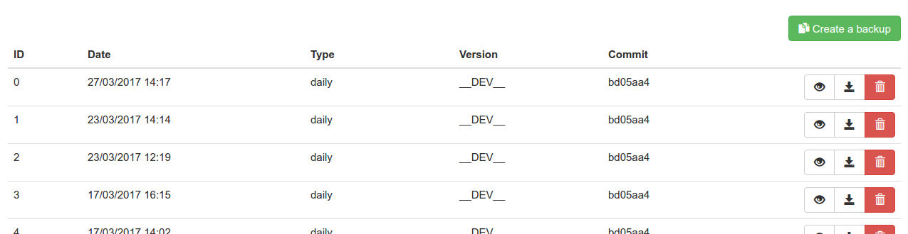

# SNBackupBundle

This BackupBundle can create backups from type daily, weekly, monthly or yearly. It'll save your default database and GaufretteFilesystems to tar.gz-archive in a GaufretteFilesystem.

## Configuration

config.yml

```yaml
knp_gaufrette:
    ...
    filesystems:
        backup_fs:
            adapter: ...

sn_backup:
    backup_folder: backup_fs
    database: mydb                  # name of your doctrine database connection (default: default)
```

## Usage

Take a snapshot of your current webapplication

    php bin/console sn:backup:dump [daily|weekly|monthly|yearly]

Get a list of all snapshots

    php bin/console sn:backup:restore

Restore a saved snapshot

    php bin/console sn:backup:restore [id]
    
Delete backups whiche are older than seven days.

    php bin/console sn:backup:cleanup [daily|weekly|monthly|yearly] 7d

### Required SNDeployBundle

Get a list of all remote snapshots

    php bin/console sn:backup:restore --remote=[prod|test|dev]
    
Download current snapshot of your remote system

    php bin/console sn:backup:restore --remote=[prod|test|dev] c
    
## WebGUI



```yaml
SNBackupBundle:
    resource: "@SNBackupBundle/Controller/"
    type: annotation
    prefix: /backup
```